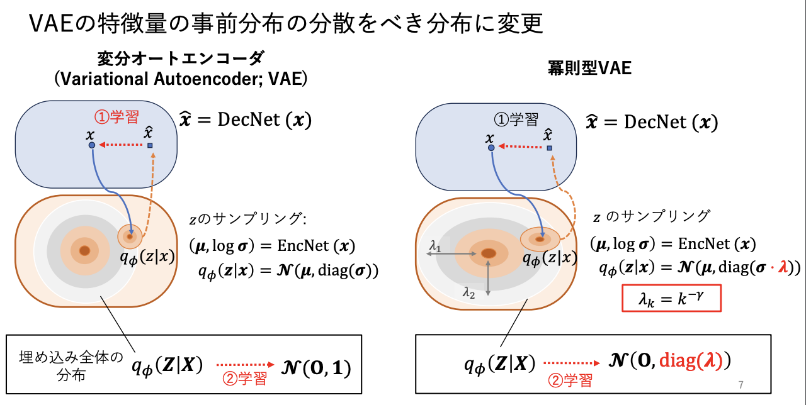
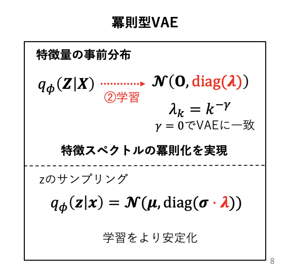

# power-law-research
実画像データセットの高次元上での広がりは冪的です。数学的には、「データセットのグラム行列の固有値分布が冪分布に従う」と表現できます。解釈としてはデータセットを PCA した際の各主成分の広がり方は、冪的に減衰していくということです。
これは、実データがある冪的な性質を持つ空間に制限されて分布しているといえます。この性質を利用して、VAE の潜在空間を入力データセットと同様に冪的に制限することで、VAE の学習を高速化・安定化させることができることを示しました。

本リポジトリは, その研究に関するコードを格納しています。


## 環境構築

Dockerを使います。
```
docker build -t power-law-research .
```

VSCode を使う場合、`.devcontainer` ディレクトリの内容がロードされ、自動で環境構築できる用になっています。

## ディレクトリの説明


研究に関するコードは `power_law_research` ディレクトリに実装されています。

```
power-law-research/
└── power_law_research
    ├── data --- データセットがダウンロードされるディレクトリ
    ├── experiments --- 修論中の実験に主に使用したコード
    └── notebooks --- 主に Jupyter notebook での実験に使用したコード

```

### 論文執筆時の実験に用いたコード

#### main file

- `power_law_research/experiments/train_cifar10_resnet18.py`
Pytorch Lightning Bolt の VAE実装を継承し、冪即化を行うVAEを実装しています。
実行ファイルとして実行した場合、冪即化パラメータを変化させながら複数回実験を実施し、
学習時の結果を `../logs` に保存します。
論文中の 「冪則化VAE」の実装クラスは `BoltScalefreeClampVAE` です。

`train_cifar10_resnet18.py` の各クラスの簡単な説明を書いておきます。
- `VAELogBeforeTraining` -- 学習初期時のロスを記録するために `pl_bolts.models.autoencoers.VAE` をラップしたクラスです。
- `BoltScalefreeVAE` -- 素朴な冪則化VAEの実装です。通常のVAEの `sample`メソッド (潜在変数のサンプリングを実装) を冪則化しています。コメント等を詳細に書いているので、本研究の実装を理解するのに役立つと思います。
- `BoltScalefreeClampVAE` -- 素朴な冪則化は、冪則化パラメータ$\gamma$が大きい場合・潜在変数の次元が大きいいばいいなど分散が極めて小さくなり、数値的に不安定になることがあります。そのため、潜在変数の分散を制限するために、`BoltScalefreeVAE` に分散制限を追加したものです。分散の制限方法として、論文中では `min_decay` の値に制限する方法を採用していますが、それまでの試行錯誤として、`clip_dim` 次元以降の分散を固定する方法なども試しており、その実装も残しています。

- `BoltScalefreeClampVAENotDecayFc` -- 潜在空間の冪則化を実現するためには、学習の目的関数を冪的ガウシアンにするだけでよく、潜在空間のサンプリングを冪的にする必要は必ずしもありません。このクラスは、潜在変数のサンプリングを通常のガウシアンに戻したものです。


- `BoltScalefreeClampWAE` -- 目的関数を KLダイバージェンスでなく Wasserstein-2 距離にしてみたものです。

- `BoltScalefreeOtherDecayVAE` -- 潜在変数の事前分布の分散を冪以外で減衰させたケースです。指数減衰・線形減衰を試しています。


### ohter files


- `experiments/train_cifar10_resnet18.analyze_log.py`
-- ロギングされたCSVをパージングして各種グラフを描写するためのノートブック。

- `experiments/draw_and_save_log.py`
-- gamma vs loss のグラフを自動描写して保存する

- `experiments/synthetic_cgd_datamodule.py` -- 様々な冪指数データを合成して作成するためのデータモジュールです

